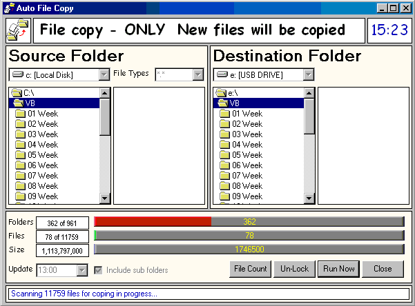



## AutoFileCopy

### Description

I made Auto File Copy to do a auto backup of a folder and subfolders twice a day to me USB drive, and only copy the new and modified files. All setting is stored in the registry. At 16:55 you can backup 5 GIG’s and only copy the files that have changes.

Enjoy and please leave comments and a vote if you like it. Thanks to the two submissions that I borrowed code from (mentioned in code)

The zip has been replaced with corrected code.
 
### More Info
 

             |
---                |---
**Submitted On**   |2003-04-15 16:53:50
**By**             |[Tony Albutt](https://github.com/Planet-Source-Code/PSCIndex/blob/master/ByAuthor/tony-albutt.md)
**Level**          |Beginner
**User Rating**    |4.9 (44 globes from 9 users)
**Compatibility**  |VB 6\.0
**Category**       |[Files/ File Controls/ Input/ Output](https://github.com/Planet-Source-Code/PSCIndex/blob/master/ByCategory/files-file-controls-input-output__1-3.md)
**World**          |[Visual Basic](https://github.com/Planet-Source-Code/PSCIndex/blob/master/ByWorld/visual-basic.md)
**Archive File**   |[AutoFileCo1574694162003\.zip](https://github.com/Planet-Source-Code/tony-albutt-autofilecopy__1-44760/archive/master.zip)

